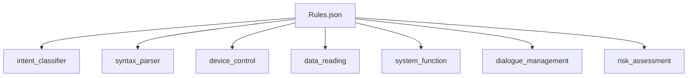
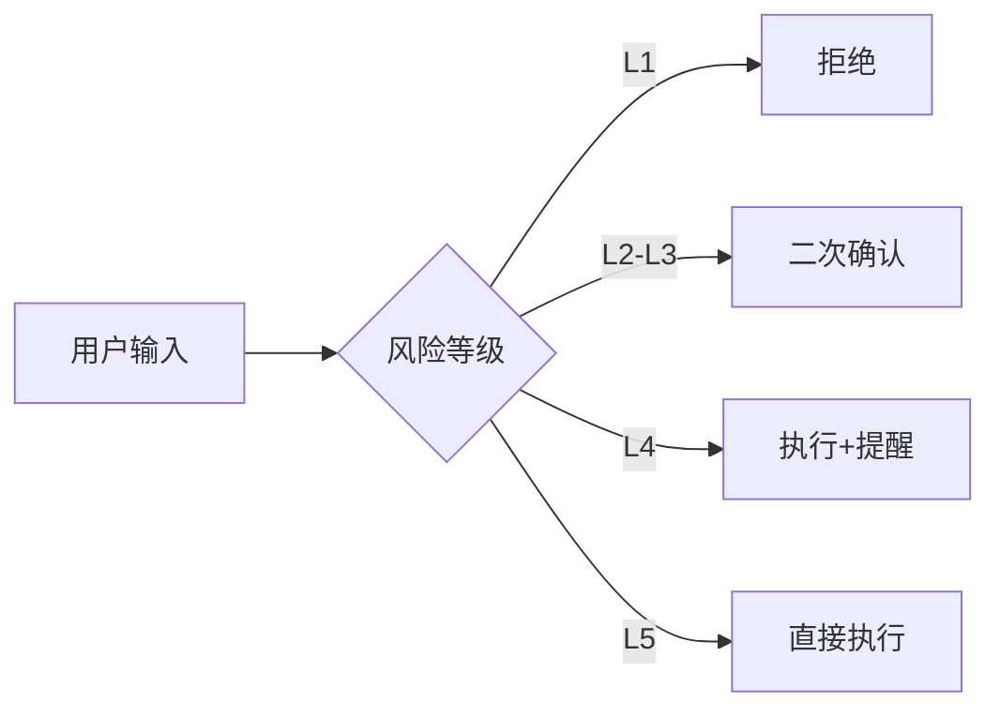
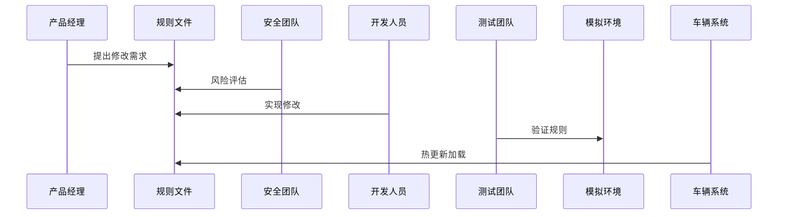

### 🤖 Assistant


# 车载语音助手规则引擎配置文件规范

## 文件概述
`Rules.json` 文件定义了车载语音助手的行为规则，包括意图识别、设备控制、风险等级评估等核心功能。本文档描述所有属性的意义及编写规范。

---

## 文件结构


---

## 1. 意图分类器 (intent_classifier)
### 属性说明
| 属性 | 类型 | 必填 | 描述 | 示例 |
|------|------|------|------|------|
| `pattern` | string | ✓ | 识别意图的正则表达式 | `"(打开|关闭)\\s*(车窗|天窗)"` |
| `priority` | integer | ✓ | 匹配优先级 (1-10，1最高) | `1` |
| `risk_level` | string | ✓ | 操作风险等级 (L1-L5) | `"L3"` |
| `type` | string | △ | 特殊类型标识 | `"global_stop"` |
| `condition` | string | △ | 非正则匹配条件 | `"length > 8"` |

### 编写规范
1. 正则表达式使用标准PCRE语法
2. 风险等级定义：
   - L1: 禁止操作（最高风险）
   - L2-L3: 需要二次确认
   - L4: 操作时提醒
   - L5: 直接执行（最低风险）
3. 相同意图的不同模式按优先级排序
4. 使用`\\`进行转义，如`\\d`表示数字

### 示例
```json
{
"device_control" : [
  {
    "pattern": "(打开|关闭)\\s*(车窗|天窗)",
    "priority": 1,
    "risk_level": "L3"
  }
]}
```

---

## 2. 语法解析器 (syntax_parser)
### 属性说明
| 属性 | 类型 | 必填 | 描述 | 示例 |
|------|------|------|------|------|
| `entity_patterns` | object | ✓ | 实体识别正则表达式集 | |
| `device` | string | ✓ | 设备名称匹配模式 | `"(空调|车窗)"` |
| `action` | string | ✓ | 操作动词匹配模式 | `"(打开|关闭)"` |
| `value` | string | ✓ | 操作值匹配模式 | `"(\\d+度)"` |
| `sensor` | string | ✓ | 传感器名称匹配模式 | `"(车速|电量)"` |
| `llm_gateway` | object | ✓ | LLM调用配置 | |
| `prompt_templates` | object | ✓ | 提示词模板 | |
| `device_control` | string | ✓ | 设备控制提示模板 | `"用户想{action}设备{device}"` |
| `sensor_query` | string | ✓ | 传感器查询模板 | `"查询{sensor}数据"` |
| `default` | string | ✓ | 默认提示模板 | `"处理请求: {text}"` |
| `risk_level` | string | ✓ | LLM调用风险等级 | `"L3"` |

### 编写规范
1. 实体模式应覆盖所有可能的表达方式
2. 提示模板使用`{变量名}`作为占位符
3. LLM调用风险等级默认为L3（中等风险）
4. 避免使用过于宽泛的正则表达式

---

## 3. 设备控制 (device_control)
### 属性说明
| 属性 | 类型 | 必填 | 描述 | 示例 |
|------|------|------|------|------|
| `allowed_devices` | array | ✓ | 允许操作的设备列表 | |
| `name` | string | ✓ | 设备名称 | `"车窗"` |
| `base_risk` | string | ✓ | 基础风险等级 | `"L3"` |
| `denied_devices` | array | ✓ | 禁止操作的设备列表 | |
| `name` | string | ✓ | 设备名称 | `"方向盘"` |
| `risk_level` | string | ✓ | 风险等级 | `"L1"` |
| `command_templates` | object | ✓ | 命令模板 | |
| `execute` | string | ✓ | 执行命令模板 | `"{device}_{action}({value})"` |
| `query` | string | ✓ | 查询命令模板 | `"{device}_status"` |
| `stop` | string | ✓ | 停止命令模板 | `"{device}_stop()"` |

### 编写规范
1. 所有设备必须明确风险等级
2. 禁止设备风险等级必须为L1
3. 命令模板使用`{变量名}`格式
4. 设备名称需与实体识别模式一致

---

## 4. 数据读取 (data_reading)
### 属性说明
| 属性 | 类型 | 必填 | 描述 | 示例 |
|------|------|------|------|------|
| `allowed_sensors` | array | ✓ | 允许查询的传感器 | |
| `name` | string | ✓ | 传感器名称 | `"车速"` |
| `risk_level` | string | ✓ | 风险等级 | `"L5"` |
| `denied_sensors` | array | ✓ | 禁止查询的传感器 | |
| `name` | string | ✓ | 传感器名称 | `"倒车雷达"` |
| `risk_level` | string | ✓ | 风险等级 | `"L1"` |

### 编写规范
1. 传感器查询默认风险等级为L5
2. 敏感传感器风险等级设为L1
3. 名称需与实体识别模式一致

---

## 5. 系统功能 (system_function)
### 属性说明
| 属性 | 类型 | 必填 | 描述 | 示例 |
|------|------|------|------|------|
| `app_launch` | array | ✓ | 应用启动规则 | |
| `pattern` | string | ✓ | 匹配模式 | `"(导航|地图)"` |
| `action` | string | ✓ | 执行动作 | `"LAUNCH_API: GaodeMap"` |
| `risk_level` | string | ✓ | 风险等级 | `"L4"` |
| `file_access` | array | ✓ | 文件访问规则 | |
| `pattern` | string | ✓ | 匹配模式 | `"(播放本地)"` |
| `action` | string | ✓ | 执行动作 | `"FILE_ACCESS: media_player"` |
| `risk_level` | string | ✓ | 风险等级 | `"L5"` |
| `web_service` | array | ✓ | 网络服务规则 | |
| `pattern` | string | ✓ | 匹配模式 | `"(天气)"` |
| `action` | string | ✓ | 执行动作 | `"CLOUD_API: weather_service"` |
| `risk_level` | string | ✓ | 风险等级 | `"L5"` |

### 编写规范
1. 每个规则必须包含风险等级
2. 动作格式：`类型: 服务名`
3. 文件访问操作风险等级不高于L4
4. 网络服务操作风险等级不高于L4

---

## 6. 对话管理 (dialogue_management)
### 属性说明
| 属性 | 类型 | 必填 | 描述 | 示例 |
|------|------|------|------|------|
| `context_rules` | array | ✓ | 上下文维持规则 | |
| `pattern` | string | ✓ | 匹配模式 | `"(刚才|继续)"` |
| `action` | string | ✓ | 执行动作 | `"CONTEXT: maintain"` |
| `risk_level` | string | ✓ | 风险等级 | `"L5"` |
| `termination_rules` | array | ✓ | 对话终止规则 | |
| `pattern` | string | ✓ | 匹配模式 | `"(退出|结束)"` |
| `action` | string | ✓ | 执行动作 | `"TERMINATE"` |
| `risk_level` | string | ✓ | 风险等级 | `"L5"` |

### 编写规范
1. 对话操作风险等级均为L5
2. 动作使用预定义关键词
3. 模式应简洁明确

---

## 7. 风险评估 (risk_assessment)
### 属性说明
| 属性 | 类型 | 必填 | 描述 | 示例 |
|------|------|------|------|------|
| `risk_levels` | array | ✓ | 风险等级定义 | |
| `level` | string | ✓ | 风险等级 (L1-L5) | `"L2"` |
| `description` | string | ✓ | 等级描述 | `"高风险 - 需要二次确认"` |
| `conditions` | array | ✓ | 触发条件 | `["speed > 60"]` |
| `action` | string | ✓ | 执行动作 | `"CONFIRM"` |
| `global_stop_conditions` | array | ✓ | 全局停止条件 | |
| `condition` | string | ✓ | 条件表达式 | `"speed > 100"` |
| `risk_level` | string | ✓ | 风险等级 | `"L1"` |
| `action` | string | ✓ | 执行动作 | `"REJECT"` |

### 编写规范
1. 条件表达式使用Python语法
2. 可用变量：`speed`(车速), `battery_level`(电量), `device`(设备)
3. 动作类型：
   - `REJECT`: 拒绝操作
   - `CONFIRM`: 需要确认
   - `WARN`: 警告后执行
   - `ALLOW`: 直接执行
4. L5必须包含空条件数组
5. 全局停止条件必须为L1风险

### 示例
```json
{
  "level": "L2",
  "description": "高风险 - 需要二次确认",
  "conditions": [
    "speed > 60 and device in ['车窗', '天窗']"
  ],
  "action": "CONFIRM"
}
```

---

## 通用编写规范
1. **风险等级一致性**：
   - 禁止操作必须标记为L1
   - 敏感操作不低于L3
   - 查询操作通常为L5

2. **命名规范**：
   - 设备/传感器名称使用中文
   - 动作使用英文动词
   - 变量名使用小写蛇形命名

3. **安全原则**：
   - 高速行驶时车窗/天窗操作不低于L3
   - 低电量时空调操作不低于L2
   - 禁止操作必须明确说明原因

4. **性能优化**：
   - 高频操作放在数组前面
   - 复杂正则添加注释
   - 避免过度宽泛的模式

5. **版本控制**：
   - 每次修改增加版本号
   - 重大变更保留历史版本
   - 使用JSON Schema验证

6. **注释规范**：
```json
{
  "pattern": "(打开|关闭)\\s*车窗", 
  "priority": 1,
  "risk_level": "L3" 
}
```

---

## 最佳实践
1. **分层设计**：


2. **风险矩阵示例**：
| 车速(km/h) | 设备 | 风险等级 | 处理方式 |
|------------|------|----------|----------|
| >80 | 车窗 | L1 | 拒绝操作 |
| 60-80 | 车窗 | L2 | 二次确认 |
| 40-60 | 车窗 | L3 | 二次确认 |
| 20-40 | 车窗 | L4 | 提醒执行 |
| <20 | 车窗 | L5 | 直接执行 |

3. **变更流程**：


本规范确保规则文件的可维护性和安全性，所有修改必须经过安全评审和测试验证后方可部署。

